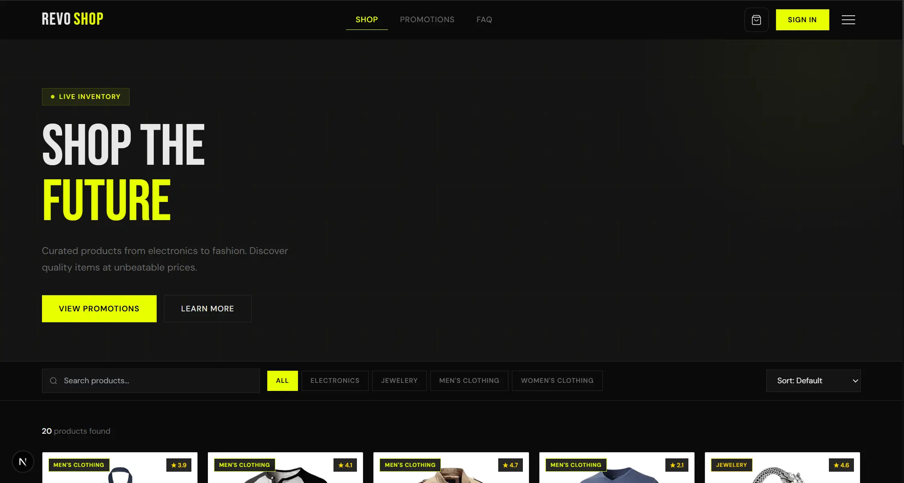
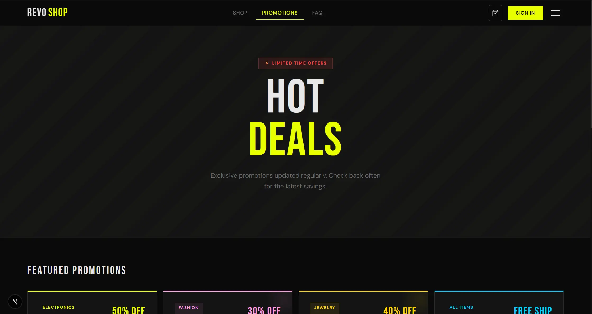
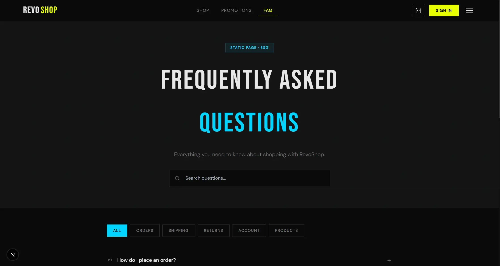
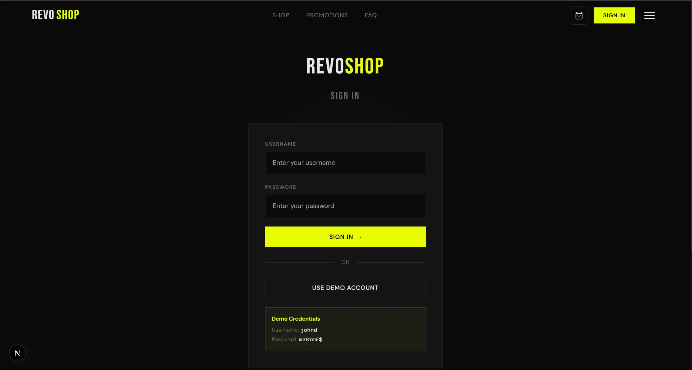

# RevoShop 🛍️

A full-stack e-commerce platform built with **Next.js 15**, **React 19**, and **TypeScript**. Built as Milestone 3 of the RevoU Frontend Engineering program.

---

## 📋 Table of Contents

- [Overview](#overview)
- [Live Demo](https://milestone-3-hilmisalsabilla.vercel.app/)
- [Tech Stack](#tech-stack)
- [Features](#features)
- [Project Structure](#project-structure)
- [Getting Started](#getting-started)
- [Pages & Routes](#pages--routes)
- [Data Fetching Strategies](#data-fetching-strategies)
- [State Management](#state-management)
- [API Reference](#api-reference)
- [Demo Credentials](#demo-credentials)

---

## Overview

RevoShop is an online store for a fictional company that allows:

- **Customers** to browse products, view details, manage a shopping cart, and sign in to their account.
- **Administrators** to manage product listings through a protected dashboard with full CRUD functionality.

---

## Tech Stack

| Technology | Version | Purpose |
|---|---|---|
| [Next.js](https://nextjs.org/) | ^15.3.0 | React framework (App Router) |
| [React](https://react.dev/) | ^19.1.0 | UI library |
| [TypeScript](https://www.typescriptlang.org/) | ^5 | Type safety |
| [Tailwind CSS](https://tailwindcss.com/) | 3.4.17 | Utility-first styling |
| [Zustand](https://zustand-demo.pmnd.rs/) | ^4.5.2 | State management (available) |
| [FakeStoreAPI](https://fakestoreapi.com/) | — | Mock product & auth API |

---

## Features

### Customer Features
- 🔍 **Product Listing** — Browse all products with live search, category filter, and sort by price/rating
- 📄 **Product Detail** — Full product info with description, rating, related products
- 🛒 **Shopping Cart** — Add/remove items, update quantity, persistent across page reloads
- 🔐 **Authentication** — Sign in/out via FakeStoreAPI, session persisted in localStorage
- 🏷️ **Promotions Page** — Static promotional offers and category deals
- ❓ **FAQ Page** — Searchable accordion FAQ with category filtering

### Admin Features
- 📊 **Dashboard** — Protected admin panel (requires login)
- ➕ **Create Product** — Add new products via modal form
- ✏️ **Edit Product** — Update existing product details
- 🗑️ **Delete Product** — Remove products with inline confirmation

### Technical Features
- ⚡ CSR, SSR, and SSG data fetching patterns
- 🔄 Loading skeletons during data fetch
- 🚨 Error boundaries and custom 404 page
- 📱 Responsive design with mobile hamburger menu
- 💾 Cart and auth state persisted in localStorage

---

## Project Structure

```
revoshop/
├── src/
│   └── app/                          # Next.js App Router
│       ├── layout.tsx                # Server Component — root HTML shell + metadata
│       ├── page.tsx                  # Home page — product listing (CSR)
│       ├── globals.css               # Global styles, CSS variables, animations
│       ├── loading.tsx               # Route transition loading UI
│       ├── not-found.tsx             # Custom 404 page
│       ├── error.tsx                 # Error boundary
│       │
│       ├── types/
│       │   └── index.ts              # TypeScript interfaces
│       │
│       ├── context/
│       │   ├── AuthContext.tsx       # Auth state — login, logout, user
│       │   └── CartContext.tsx       # Cart state — items, totals, CRUD
│       │
│       ├── components/
│       │   ├── Providers.tsx         # Client wrapper for all context providers
│       │   ├── Navbar.tsx            # Navigation bar with cart badge
│       │   ├── ProductCard.tsx       # Product grid card
│       │   └── Footer.tsx            # Site footer
│       │
│       ├── product/[id]/
│       │   └── page.tsx              # Dynamic product detail page (SSR)
│       ├── cart/
│       │   └── page.tsx              # Shopping cart
│       ├── login/
│       │   └── page.tsx              # Login page
│       ├── faq/
│       │   └── page.tsx              # FAQ — static content (SSG)
│       ├── promotions/
│       │   └── page.tsx              # Promotions — static content (SSG)
│       └── dashboard/
│           └── page.tsx              # Admin CRUD dashboard (protected)
│
├── next.config.mjs                   # Next.js configuration
├── tailwind.config.ts                # Tailwind theme customization
├── postcss.config.js                 # PostCSS configuration
├── tsconfig.json                     # TypeScript configuration
└── package.json                      # Dependencies and scripts
```

---

## Preview

[Live Demo at Vercel](https://milestone-3-hilmisalsabilla.vercel.app/)

### Landing Page


### Promotion Page


### FAQ Page


### Login Page


---

## Getting Started

### Prerequisites

- Node.js 18.17 or later
- npm or yarn

### Installation

```bash
# 1. Clone the repository
git clone <your-repo-url>
cd revoshop

# 2. Install dependencies
npm install

# 3. Start the development server
npm run dev

# 4. Open in browser
# http://localhost:3000
```

### Available Scripts

```bash
npm run dev      # Start development server (with Turbopack)
npm run build    # Build for production
npm run start    # Start production server
```

---

## Pages & Routes

| Route | Page | Access |
|---|---|---|
| `/` | Home — product listing with search & filter | Public |
| `/product/[id]` | Product detail with add to cart | Public |
| `/cart` | Shopping cart with order summary | Public |
| `/login` | Sign in page | Public |
| `/faq` | Frequently asked questions | Public |
| `/promotions` | Current promotions and deals | Public |
| `/dashboard` | Admin product management (CRUD) | 🔒 Auth required |

---

## Data Fetching Strategies

### CSR — Client-Side Rendering
Used on the **Home page** (`/`). Products are fetched in the browser using `useEffect` + `fetch` after the page loads. This allows interactive filtering and searching without full page reloads.

```tsx
useEffect(() => {
  fetch("https://fakestoreapi.com/products")
    .then(res => res.json())
    .then(data => setProducts(data));
}, []);
```

### SSR — Server-Side Rendering
Used on the **Product Detail page** (`/product/[id]`). Data is fetched dynamically per request so each product page always has up-to-date information.

### SSG — Static Site Generation
Used on the **FAQ** (`/faq`) and **Promotions** (`/promotions`) pages. These pages use static data defined in the component — no API calls needed. They are pre-rendered at build time for fast load performance.

---

## State Management

State is managed using React **Context API** with `useState` and `useEffect`.

### AuthContext
Provides authentication state across the entire app.

```tsx
const { user, isAuthenticated, login, logout, isLoading, error } = useAuth();
```

| Value | Type | Description |
|---|---|---|
| `user` | `User \| null` | Currently signed-in user object |
| `isAuthenticated` | `boolean` | Whether a user is logged in |
| `login(credentials)` | `function` | POST to FakeStoreAPI auth endpoint |
| `logout()` | `function` | Clears user from state and localStorage |

### CartContext
Provides cart state and item management.

```tsx
const { items, addToCart, removeFromCart, updateQuantity, clearCart, totalItems, totalPrice } = useCart();
```

| Value | Type | Description |
|---|---|---|
| `items` | `CartItem[]` | All items currently in the cart |
| `addToCart(product)` | `function` | Add a product or increment its quantity |
| `removeFromCart(id)` | `function` | Remove a product entirely |
| `updateQuantity(id, qty)` | `function` | Set a specific quantity |
| `totalItems` | `number` | Sum of all item quantities |
| `totalPrice` | `number` | Sum of all item prices |

Both contexts persist their state to **localStorage** so the cart and session survive page refreshes.

---

## API Reference

All product and auth data comes from [FakeStoreAPI](https://fakestoreapi.com).

| Method | Endpoint | Usage |
|---|---|---|
| `GET` | `/products` | Fetch all products (Home page) |
| `GET` | `/products/:id` | Fetch single product (Detail page) |
| `GET` | `/products/category/:name` | Fetch products by category |
| `GET` | `/products/categories` | Fetch all category names |
| `POST` | `/products` | Create a product (Dashboard) |
| `PUT` | `/products/:id` | Update a product (Dashboard) |
| `DELETE` | `/products/:id` | Delete a product (Dashboard) |
| `POST` | `/auth/login` | Authenticate a user (Login page) |
| `GET` | `/users/1` | Fetch user profile after login |

> **Note:** FakeStoreAPI is a mock API. Create, update, and delete operations return simulated responses but do not persist real data changes.

---

## Demo Credentials

To access the admin **Dashboard**, sign in with the demo account:

```
Username: johnd
Password: m38rmF$
```

These credentials are provided by FakeStoreAPI for testing purposes.

---

## Design System

The UI uses a custom dark industrial aesthetic with the following design tokens defined in `globals.css`:

| Token | Value | Usage |
|---|---|---|
| `--color-bg` | `#0a0a0a` | Page background |
| `--color-surface` | `#141414` | Card / panel backgrounds |
| `--color-border` | `#2a2a2a` | Borders and dividers |
| `--color-text` | `#e8e8e8` | Primary text |
| `--color-muted` | `#6a6a6a` | Secondary / placeholder text |
| `--color-accent` | `#e8ff00` | Primary accent (yellow-green) |
| `--color-accent2` | `#ff3d3d` | Danger / error accent |
| `--color-accent3` | `#00d4ff` | Info accent (cyan) |

**Fonts:**
- Display: [Bebas Neue](https://fonts.google.com/specimen/Bebas+Neue) — headings and prices
- Body: [DM Sans](https://fonts.google.com/specimen/DM+Sans) — UI text
- Mono: [DM Mono](https://fonts.google.com/specimen/DM+Mono) — IDs, codes, numbers
